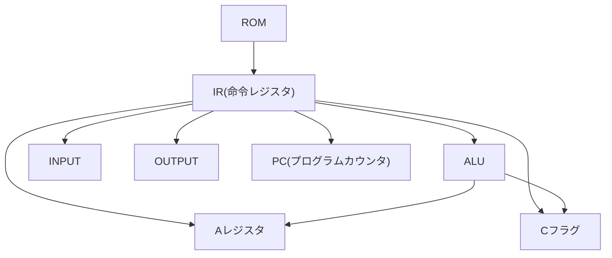

# 2bit CPU ブロック構造

```mermaid
graph TD

    %% ブロック定義
    ROM["ROM"]
    IR["IR(命令レジスタ)"]
    ALU["ALU"]
    A["Aレジスタ"]
    C["Cフラグ"]
    INPUT["INPUT"]
    OUTPUT["OUTPUT"]
    PC["PC(プログラムカウンタ)"]

    %% ROMからIR
    ROM --> IR

    %% IRから各ブロックへの制御
    IR --> PC
    IR --> A
    IR --> C
    IR --> ALU
    IR --> INPUT
    IR --> OUTPUT

    %% ALUの関係性補足
    ALU --> A
    ALU --> C

```
