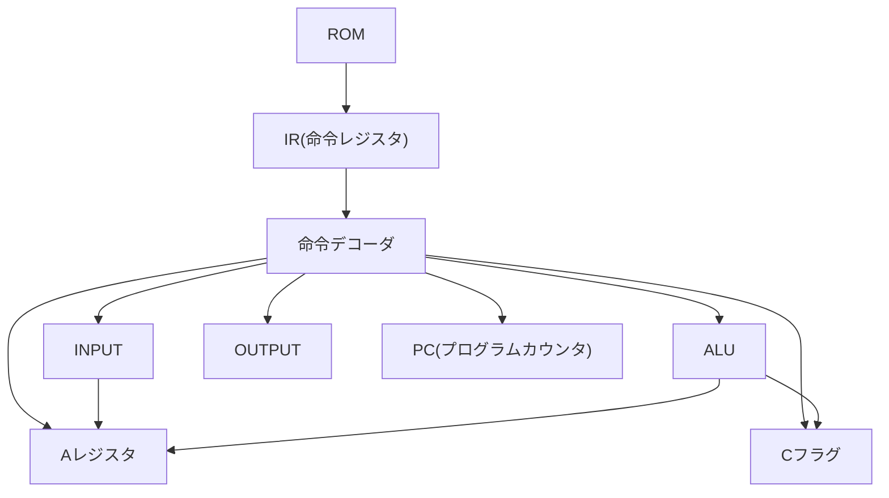

# 2bit CPU ブロック構造

```mermaid
graph TD

    %% ブロック定義
    ROM["ROM"]
    IR["IR(命令レジスタ)"]
    DEC["命令デコーダ"]
    ALU["ALU"]
    A["Aレジスタ"]
    C["Cフラグ"]
    INPUT["INPUT"]
    OUTPUT["OUTPUT"]
    PC["PC(プログラムカウンタ)"]

    %% ROMから命令デコーダー
    ROM --> IR
    IR --> DEC

    %% 命令デコーダー関係性
    DEC --> PC
    DEC --> A
    DEC --> C
    DEC --> ALU
    DEC --> INPUT
    DEC --> OUTPUT

    %% Aレジスタ、ALUの補足関係性
    INPUT --> A
    ALU --> A
    ALU --> C

```
