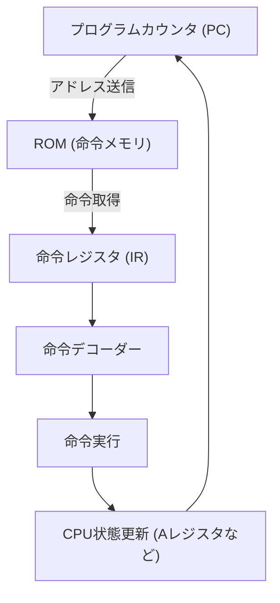

# 2bit CPU 処理フロー

```mermaid
flowchart TD

    %% ブロック定義
    PC["プログラムカウンタ (PC)"]
    ROM["ROM (命令メモリ)"]
    IR["命令レジスタ (IR)"]
    DECODE["命令デコーダー"]
    EXEC["命令実行"]
    REG["CPU状態更新 (Aレジスタなど)"]

    %% データフロー
    PC -->|アドレス送信| ROM
    ROM -->|命令取得| IR
    IR --> DECODE
    DECODE --> EXEC
    EXEC --> REG
    REG --> PC

```
